<p align="center">
  
</p>

# Grassmann.jl

*⟨Leibniz-Grassmann-Clifford-Hestenes⟩ differential geometric algebra / multivector simplicial complex*

[](https://travis-ci.org/chakravala/Grassmann.jl)
[](https://ci.appveyor.com/project/chakravala/grassmann-jl)
[](https://coveralls.io/github/chakravala/Grassmann.jl?branch=master)
[](http://codecov.io/github/chakravala/Grassmann.jl?branch=master)
[](https://gitter.im/Grassmann-jl/community?utm_source=badge&utm_medium=badge&utm_campaign=pr-badge)
[](https://liberapay.com/chakravala)

The [Grassmann.jl](https://github.com/chakravala/Grassmann.jl) package provides tools for doing computations based on multi-linear algebra, differential geometry, and spin groups using the extended tensor algebra known as Leibniz-Grassmann-Clifford-Hestenes geometric algebra.
Combinatorial products include `∧, ∨, ⋅, *, ⋆, ', ~, ∂` (which are the exterior, regressive, inner, and geometric products; along with the Hodge star, adjoint, reversal, and boundary operators).
The kernelized operations are built up from composite sparse tensor products and Hodge duality, with high dimensional support for up to 62 indices using staged caching and precompilation. Code generation enables concise yet highly extensible definitions.
The [DirectSum.jl](https://github.com/chakravala/DirectSum.jl) multivector parametric type polymorphism is based on tangent bundle vector spaces and conformal projective geometry to make the dispatch highly extensible for many applications.
Additionally, the universal interoperability between different sub-algebras is enabled by [AbstractTensors.jl](https://github.com/chakravala/AbstractTensors.jl), on which the type system is built.

[](https://www.youtube.com/watch?v=eQjDN0JQ6-s)
[](https://www.dropbox.com/sh/tphh6anw0qwija4/AAACiaXig5djrLVAKLPFmGV-a/Geometric-Algebra?preview=grassmann-juliacon-2019.pdf)
[](https://zenodo.org/badge/latestdoi/101519786)
[](https://bivector.net)

  * [Design, code generation](#design-code-generation)
	 * [Requirements](#requirements)
	 * [Grassmann for enterprise](#grassmann-for-enterprise)
  * [Direct-sum yields VectorBundle parametric type polymorphism ⨁](#direct-sum-yields-vectorspace-parametric-type-polymorphism-)
	 * [Interoperability for TensorAlgebra{V}](#interoperability-for-tensoralgebrav)
  * [Generating elements and geometric algebra Λ(V)](#generating-elements-and-geometric-algebra-λv)
	 * [Approaching ∞ dimensions with SparseAlgebra and ExtendedAlgebra](#approaching--dimensions-with-sparsealgebra-and-extendedalgebra)
	 * [Null-basis of the projective split](#null-basis-of-the-projective-split)
	 * [Differential forms and Leibniz tangent algebra](#differential-forms-and-leibniz-tangent-algebra)
  * [Constructing linear transformations from mixed tensor product ⊗](#constructing-linear-transformations-from-mixed-tensor-product-)
  * [Importing the generators of the Leech lattice](#importing-the-generators-of-the-leech-lattice)
  * [Symbolic coefficients by declaring an alternative scalar algebra](#symbolic-coefficients-by-declaring-an-alternative-scalar-algebra)
  * [References](#references)

#### Design, code generation

Mathematical foundations and some of the nuances in the definitions specific to the [Grassmann.jl](https://github.com/chakravala/Grassmann.jl) implementation are concisely described, along with the accompanying support packages that provide an extensible platform for computing with geometric algebra at high dimensions.
The design is based on the `TensorAlgebra` abstract type interoperability from [AbstractTensors.jl](https://github.com/chakravala/AbstractTensors.jl) with a `VectorBundle` parameter from [DirectSum.jl](https://github.com/chakravala/DirectSum.jl).
Abstract tangent vector space type operations happen at compile-time, resulting in a differential conformal geometric algebra of hyper-dual multivector forms.

The nature of the geometric algebra code generation enables one to easily extend the abstract product operations to any specific number field type (including differential operators with [Leibniz.jl](https://github.com/chakravala/Leibniz.jl) or symbolic coefficients with [Reduce.jl](https://github.com/chakravala/Reduce.jl)), by making use of Julia's type system. Mixed tensor products with their coefficients are constructed from these operations to work with bivector elements of Lie groups.

* **DirectSum.jl**: Abstract tangent bundle vector space types (unions, intersections, sums, etc.)
* **AbstractTensors.jl**: Tensor algebra abstract type interoperability with vector bundle parameter
* **Grassmann.jl**: ⟨Leibniz-Grassmann-Clifford-Hestenes⟩ differential geometric algebra of multivector forms
* **Leibniz.jl**: Derivation operator algebras for tensor fields
* **Reduce.jl**: Symbolic parser generator for Julia expressions using REDUCE algebra term rewriter

Mathematics of `Grassmann` can be used to study unitary groups used in quantum computing by building efficient computational representations of their algebras.
Applicability of the Grassmann computational package not only maps to quantum computing, but has the potential of impacting countless other engineering and scientific computing applications.
It can be used to work with automatic differentiation and differential geometry, algebraic forms and invariant theory, electric circuits and wave scattering, spacetime geometry and relativity, computer graphics and photogrammetry, and much more.

```Julia
using Grassmann, Makie; @basis S"∞+++"
streamplot(vectorfield(exp((π/4)*(v12+v∞3)),V(2,3,4),V(1,2,3)),-1.5..1.5,-1.5..1.5,-1.5..1.5,gridsize=(10,10))
```
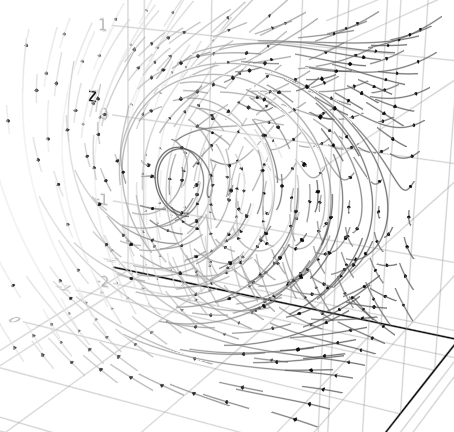

Due to the abstract generality of the product algebra code generation, it is possible to extend the `Grassmann` library to include additional high performance products with few extra definitions.
Operations on ultra-sparse representations for very high dimensional algebras will be gaining further performance enhancements in future updates, along with the standard lower dimensional algebras to be fully optimized.
Thanks to the design of the product algebra code generation, any additional optimizations to the type stability will automatically enhance all the different products simultaneously.
Likewise, any new product formulas will be able to quickly gain from the setup of all of the existing optimizations.

The *Grassmann.jl* package and its accompanying support packages provide an extensible platform for high performance computing with geometric algebra at high dimensions.
This enables the usage of many different types of `TensorAlgebra` along with various `VectorBundle` parameters and interoperability for a wide range of scientific and research applications.

### Requirements

Availability of this package and its subpackages can be automatically handled with the Julia package manager; however, when the `master` branch is used it is possible that some of the dependencies also require a development branch before the release. This may include (but is not limited to) the following packages:

This requires a merged version of `ComputedFieldTypes` at https://github.com/vtjnash/ComputedFieldTypes.jl

Interoperability of `TensorAlgebra` with other packages is automatically enabled by [DirectSum.jl](https://github.com/chakravala/DirectSum.jl) and [AbstractTensors.jl](https://github.com/chakravala/AbstractTensors.jl).

The package is compatible via [Requires.jl](https://github.com/MikeInnes/Requires.jl) with 
[Reduce.jl](https://github.com/chakravala/Reduce.jl)
[SymPy.jl](https://github.com/JuliaPy/SymPy.jl),
[SymEngine.jl](https://github.com/symengine/SymEngine.jl),
[AbstractAlgebra.jl](https://github.com/wbhart/AbstractAlgebra.jl),
[Nemo.jl](https://github.com/wbhart/Nemo.jl),
[GaloisFields.jl](https://github.com/tkluck/GaloisFields.jl),
[LightGraphs,jl](https://github.com/JuliaGraphs/LightGraphs.jl),
[Compose.jl](https://github.com/GiovineItalia/Compose.jl),
[GeometryTypes,jl](https://github.com/JuliaGeometry/GeometryTypes.jl),
[Makie.jl](https://github.com/JuliaPlots/Makie.jl).

## Grassmann for enterprise

Available as part of the Tidelift Subscription

The maintainers of Grassmann and thousands of other packages are working with Tidelift to deliver commercial support and maintenance for the open source dependencies you use to build your applications. Save time, reduce risk, and improve code health, while paying the maintainers of the exact dependencies you use. [Learn more.](https://tidelift.com/subscription/pkg/julia-grassmann?utm_source=julia-grassmann&utm_medium=referral&utm_campaign=enterprise&utm_term=repo)

## Direct-sum yields `VectorBundle` parametric type polymorphism ⨁

The *DirectSum.jl* package is a work in progress providing the necessary tools to work with an arbitrary `Manifold` specified by an encoding.
Due to the parametric type system for the generating `VectorBundle`, the Julia compiler can fully preallocate and often cache values efficiently ahead of run-time.
Although intended for use with the *Grassmann.jl* package, `DirectSum` can be used independently.

Let `N` be the rank of a `Manifold{N}`.
The type `VectorBundle{N,P,g,ν,μ}` uses *byte-encoded* data available at pre-compilation, where
`P` specifies the basis for up and down projection,
`g` is a bilinear form that specifies the metric of the space,
and `μ` is an integer specifying the order of the tangent bundle (i.e. multiplicity limit of Leibniz-Taylor monomials). Lastly, `ν` is the number of tangent variables.

The metric signature of the `Basis{V,1}` elements of a vector space `V` can be specified with the `V"..."` constructor by using `+` and `-` to specify whether the `Basis{V,1}` element of the corresponding index squares to `+1` or `-1`.
For example, `S"+++"` constructs a positive definite 3-dimensional `VectorBundle`.
```Julia
julia> ℝ^3 == V"+++" == vectorspace(3)
true
```
It is also possible to specify an arbitrary `DiagonalForm` having numerical values for the basis with degeneracy `D"1,1,1,0"`, although the `Signature` format has a more compact representation.
Further development will result in more metric types.

Declaring an additional plane at infinity is done by specifying it in the string constructor with `∞` at the first index (i.e. Riemann sphere `S"∞+++"`). The hyperbolic geometry can be declared by `∅` subsequently (i.e. Minkowski spacetime `S"∅+++"`).
Additionally, the *null-basis* based on the projective split for confromal geometric algebra would be specified with `∞∅` initially (i.e. 5D CGA `S"∞∅+++"`). These two declared basis elements are interpreted in the type system.

The `tangent` map takes `V` to its tangent space and can be applied repeatedly for higher orders, such that `tangent(V,μ,ν)` can be used to specify `μ` and `ν`.
```Julia
julia> V = tangent(ℝ^3)
⟨+++₁⟩

julia> V'
⟨---¹⟩'

julia> V+V'
⟨+++---₁¹⟩*
```
The direct sum operator `⊕` can be used to join spaces (alternatively `+`), and the dual space functor `'` is an involution which toggles a dual vector space with inverted signature.
```Julia
julia> V = ℝ'⊕ℝ^3
⟨-+++⟩

julia> V'
⟨+---⟩'

julia> W = V⊕V'
⟨-++++---⟩*
```
The direct sum of a `VectorBundle` and its dual `V⊕V'` represents the full mother space `V*`.
```Julia
julia> collect(V) # all vector basis elements
Grassmann.Algebra{⟨-+++⟩,16}(v, v₁, v₂, v₃, v₄, v₁₂, v₁₃, v₁₄, v₂₃, v₂₄, v₃₄, v₁₂₃, v₁₂₄, v₁₃₄, ...)

julia> collect(V') # all covector basis elements
Grassmann.Algebra{⟨+---⟩',16}(w, w¹, w², w³, w⁴, w¹², w¹³, w¹⁴, w²³, w²⁴, w³⁴, w¹²³, w¹²⁴, w¹³⁴, ...)

julia> collect(W) # all mixed basis elements
Grassmann.Algebra{⟨-++++---⟩*,256}(v, v₁, v₂, v₃, v₄, w¹, w², w³, w⁴, v₁₂, v₁₃, v₁₄, v₁w¹, v₁w², ...
```
In addition to the direct-sum operation, several other operations are supported, such as `∪,∩,⊆,⊇` for set operations.
Due to the design of the `VectorBundle` dispatch, these operations enable code optimizations at compile-time provided by the bit parameters.
```Julia
julia> ℝ+ℝ' ⊇ vectorspace(1)
true

julia> ℝ ∩ ℝ' == vectorspace(0)
true

julia> ℝ ∪ ℝ' == ℝ+ℝ'
true
```
**Remark**. Although some of the operations like `∪` and `⊕` are similar and sometimes result in the same values, the `union` and `sum` are entirely different operations in general.

Calling manifolds with sets of indices constructs the subspace representations.
Given `M(s::Int...)` one can encode `SubManifold{length(s),M,s}` with induced orthogonal space, such that computing unions of submanifolds is done by inspecting the parameter `s`.
Operations on `Manifold` types is automatically handled at compile time.

More information about `DirectSum` is available  at https://github.com/chakravala/DirectSum.jl

### Interoperability for `TensorAlgebra{V}`

The `AbstractTensors` package is intended for universal interoperability of the abstract `TensorAlgebra` type system.
All `TensorAlgebra{V}` subtypes have type parameter `V`, used to store a `VectorBundle` value obtained from *DirectSum.jl*.
By itself, this package does not impose any specifications or structure on the `TensorAlgebra{V}` subtypes and elements, aside from requiring `V` to be a `VectorBundle`.
This means that different packages can create tensor types having a common underlying `VectorBundle` structure.

The key to making the whole interoperability work is that each `TensorAlgebra` subtype shares a `VectorBundle` parameter (with all `isbitstype` parameters), which contains all the info needed at compile time to make decisions about conversions. So other packages need only use the vector space information to decide on how to convert based on the implementation of a type. If external methods are needed, they can be loaded by `Requires` when making a separate package with `TensorAlgebra` interoperability.

Since `VectorBundle` choices are fundamental to `TensorAlgebra` operations, the universal interoperability between `TensorAlgebra{V}` elements with different associated `VectorBundle` choices is naturally realized by applying the `union` morphism to operations.
Some of the method names like `+,-,\otimes,\times,\cdot,*` for `TensorAlgebra` elements are shared across different packages, with interoperability.

Additionally, a universal unit volume element can be specified in terms of `LinearAlgebra.UniformScaling`, which is independent of `V` and has its interpretation only instantiated by the context of the `TensorAlgebra{V}` element being operated on.
The universal interoperability of `LinearAlgebra.UniformScaling` as a pseudoscalar element which takes on the `VectorBundle` form of any other `TensorAlgebra` element is handled globally.
This enables the usage of `I` from `LinearAlgebra` as a universal pseudoscalar element.

## Generating elements and geometric algebra Λ(V)

Combining the linear basis generating elements with each other using the multilinear tensor product yields a graded (decomposable) tensor `Basis` ⟨w₁⊗⋯⊗wₖ⟩, where `grade` is determined by the number of anti-symmetric basis elements in its tensor product decomposition.
The algebra is partitioned into both symmetric and anti-symmetric tensor equivalence classes.
Higher-order composite tensor elements are oriented-multi-sets.
Anti-symmetric indices have two orientations and higher multiplicities of them result in zero values, so the only interesting multiplicity is 1.
The Leibniz-Taylor algebra is a quotient polynomial ring  so that `ϵₖ^(μ+1)` is zero.

The Grassmann `Basis` elements `vₖ` and `wᵏ` are linearly independent vector and covector elements of `V`, while the Leibniz `Operator` elements `∂ₖ` are partial tangent derivations and `ϵᵏ` are dependent functions of the `tangent` manifold.
Higher `grade` elements correspond to `SubManifold` subspaces, while higher `order` function elements become homogenous polynomials and Taylor series.

Grassmann's exterior algebra doesn't invoke the properties of multi-sets, as it is related to the algebra of oriented sets; while the Leibniz symmetric algebra is that of unoriented multi-sets.
Combined, the mixed-symmetry algebra yield a multi-linear propositional lattice.
The formal sum of equal `grade` elements is an oriented `Chain` and with mixed `grade` it is a `MultiVector` simplicial complex.
Thus, various standard operations on the oriented multi-sets are possible including `∪,∩,⊕` and the index operation `⊖`, which is symmetric difference operation `⊻`.

By virtue of Julia's multiple dispatch on the field type `T`, methods can specialize on the `Dimension{N}` and `Grade{G}` and `VectorBundle{N,D,O}` via the `TensorAlgebra` subtypes, such as `Basis{V,G}`, `Simplex{V,G,B,T}`, `MSimplex{V,G,B,T}`, `SChain{T,V,G}`, `MChain{T,V,G}`, `MultiVector{T,V}`, and `MultiGrade{V}` types.

For the oriented sets of the Grassmann exterior algebra, the parity of `(-1)^P` is factored into transposition compositions when interchanging ordering of the tensor product argument permutations.
The symmetrical algebra does not need to track this parity, but has higher multiplicities in its indices.
Symmetric differential function algebra of Leibniz trivializes the orientation into a single class of index multi-sets, while Grassmann's exterior algebra is partitioned into two oriented equivalence classes by anti-symmetry.
Full tensor algebra can be sub-partitioned into equivalence classes in multiple ways based on the element symmetry, grade, and metric signature composite properties.
Both symmetry classes can be characterized by the same geometric product.

The elements of the `Algebra` can be generated in many ways using the `Basis` elements created by the `@basis` macro,
```Julia
julia> using Grassmann; @basis ℝ'⊕ℝ^3 # equivalent to basis"-+++"
(⟨-+++⟩, v, v₁, v₂, v₃, v₄, v₁₂, v₁₃, v₁₄, v₂₃, v₂₄, v₃₄, v₁₂₃, v₁₂₄, v₁₃₄, v₂₃₄, v₁₂₃₄)
```
As a result of this macro, all of the `Basis{V,G}` elements generated by that `VectorBundle` become available in the local workspace with the specified naming.
The first argument provides signature specifications, the second argument is the variable name for the `VectorBundle`, and the third and fourth argument are the the prefixes of the `Basis` vector names (and covector basis names). By default, `V` is assigned the `VectorBundle` and `v` is the prefix for the `Basis` elements.
```Julia
julia> V # Minkowski spacetime
⟨-+++⟩

julia> typeof(V) # dispatch by vector space
VectorBundle{4,0,0x0000000000000001}

julia> typeof(v13) # extensive type info
Basis{⟨-+++⟩,2,0x0000000000000005}

julia> v13∧v2 # exterior tensor product
-1v₁₂₃

julia> ans^2 # applies geometric product
1v

julia> @btime h = 2v1+v3 # vector element
  37.794 ns (3 allocations: 80 bytes)
2v₁ + 0v₂ + 1v₃ + 0v₄

julia> @btime $h⋅$h # inner product
  105.948 ns (2 allocations: 160 bytes)
-3v
```
It is entirely possible to assign multiple different bases with different signatures without any problems. In the following command, the `@basis` macro arguments are used to assign the vector space name to `S` instead of `V` and basis elements to `b` instead of `v`, so that their local names do not interfere:
```Julia
julia> @basis "++++" S b;

julia> let k = (b1+b2)-b3
           for j ∈ 1:9
               k = k*(b234+b134)
               println(k)
       end end
0 + 1v₁₄ + 1v₂₄ + 2v₃₄
0 - 2v₁ - 2v₂ + 2v₃
0 - 2v₁₄ - 2v₂₄ - 4v₃₄
0 + 4v₁ + 4v₂ - 4v₃
0 + 4v₁₄ + 4v₂₄ + 8v₃₄
0 - 8v₁ - 8v₂ + 8v₃
0 - 8v₁₄ - 8v₂₄ - 16v₃₄
0 + 16v₁ + 16v₂ - 16v₃
0 + 16v₁₄ + 16v₂₄ + 32v₃₄
```
Alternatively, if you do not wish to assign these variables to your local workspace, the versatile `Grassmann.Algebra{N}` constructors can be used to contain them, which is exported to the user as the method `Λ(V)`,
```Julia
julia> G3 = Λ(3) # equivalent to Λ(V"+++"), Λ(ℝ^3), Λ.V3
Grassmann.Algebra{⟨+++⟩,8}(v, v₁, v₂, v₃, v₁₂, v₁₃, v₂₃, v₁₂₃)

julia> G3.v13 * G3.v12
v₂₃
```
The *geometric algebraic product* is the oriented symmetric difference operator `⊖` (weighted by the bilinear form `g`) and multi-set sum `⊕` applied to multilinear tensor products `⊗` in a single operation.
Symmetry properties of the tensor algebra can be characterized in terms of the geometric product by two averaging operations, which are the symmetrization `⊙` and anti-symmetrization `⊠` operators.
These products satisfy various `MultiVector` properties, including the associative and distributive laws.


It is possible to assign the **quaternion** generators `i,j,k` with
```Julia
julia> i,j,k = hyperplanes(ℝ^3)
3-element Array{Simplex{⟨+++⟩,2,B,Int64} where B,1}:
 -1v₂₃
 1v₁₃
 -1v₁₂

julia> @btime i^2, j^2, k^2, i*j*k
  158.925 ns (5 allocations: 112 bytes)
(-1v, -1v, -1v, -1v)

julia> @btime -(j+k) * (j+k)
  176.233 ns (8 allocations: 240 bytes)
2

julia> @btime -(j+k) * i
  111.394 ns (6 allocations: 192 bytes)
0 - 1v₁₂ - 1v₁₃
```
Alternatively, another representation of the quaternions is
```Julia
julia> basis"--"
(⟨--⟩, v, v₁, v₂, v₁₂)

julia> v1^2, v2^2, v12^2, v1*v2*v12
(-1v, -1v, -1v, -1v)
```
With the preliminary implementations of the `exp` and `log` functions one can compute
```Julia
julia> exp(0.5π/2*(i+j)/sqrt(2))
0.7071067811865476 + 0.5v₁₃ - 0.5v₂₃

julia> ans == (sqrt(2)+j+i)/2
true

julia> log1p(i)
0.34657359027997264 - 0.7853981633974485v₂₃

julia> log(i)
0.0 - 1.5708963467978978v₂₃
```
The parametric type formalism in `Grassmann` is highly expressive to enable the pre-allocation of geometric algebra computations for specific sparse-subalgebras, including the representation of rotational groups, Lie bivector algebras, and affine projective geometry.

Together with [LightGraphs,jl](https://github.com/JuliaGraphs/LightGraphs.jl), [GraphPlot.jl](https://github.com/JuliaGraphs/GraphPlot.jl), [Cairo.jl](https://github.com/JuliaGraphics/Cairo.jl), [Compose.jl](https://github.com/GiovineItalia/Compose.jl) it is possible to convert `Grassmann` numbers into graphs.
```Julia
using Grassmann, Compose # environment: LightGraphs, GraphPlot
x = Grassmann.Algebra(ℝ^7).v123
Grassmann.graph(x+!x)
draw(PDF("simplex.pdf",16cm,16cm),x+!x)
```
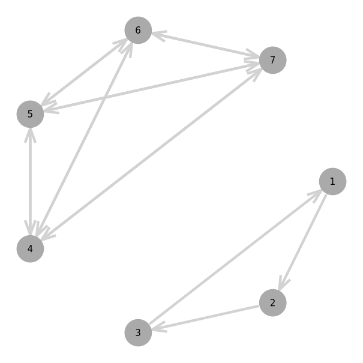

Due to [GeometryTypes,jl](https://github.com/JuliaGeometry/GeometryTypes.jl) `Point` interoperability, plotting and visualizing with [Makie.jl](https://github.com/JuliaPlots/Makie.jl) is easily possible. For example, the `vectorfield` method creates an anonymous `Point` function that applies a versor outermorphism:
```Julia
using Grassmann, Makie
basis"2" # Euclidean
streamplot(vectorfield(exp(π*v12/2)),-1.5..1.5,-1.5..1.5)
streamplot(vectorfield(exp((π/2)*v12/2)),-1.5..1.5,-1.5..1.5)
streamplot(vectorfield(exp((π/4)*v12/2)),-1.5..1.5,-1.5..1.5)
streamplot(vectorfield(v1*exp((π/4)*v12/2)),-1.5..1.5,-1.5..1.5)
@basis S"+-" # Hyperbolic
streamplot(vectorfield(exp((π/8)*v12/2)),-1.5..1.5,-1.5..1.5)
streamplot(vectorfield(v1*exp((π/4)*v12/2)),-1.5..1.5,-1.5..1.5)
```
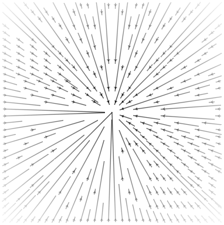 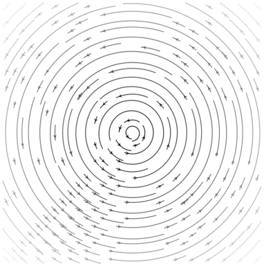
 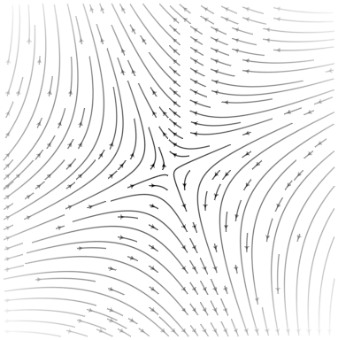
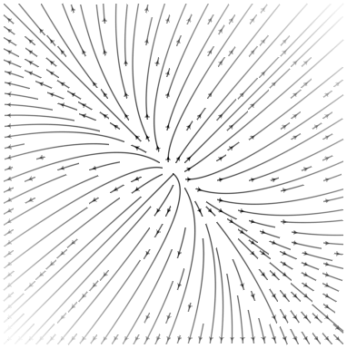 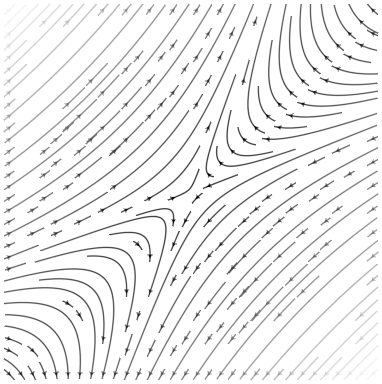

```Julia
using Grassmann, Makie
@basis S"∞+++"
f(t) = (↓(exp(π*t*((3/7)*v12+v∞3))>>>↑(v1+v2+v3)))
lines(points(f,V(2,3,4)))
@basis S"∞∅+++"
f(t) = (↓(exp(π*t*((3/7)*v12+v∞3))>>>↑(v1+v2+v3)))
lines(points(f,V(3,4,5)))
```
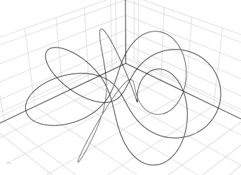 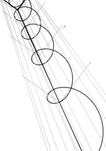

```Julia
using Grassmann, Makie; @basis S"∞+++"
streamplot(vectorfield(exp((π/4)*(v12+v∞3)),V(2,3,4)),-1.5..1.5,-1.5..1.5,-1.5..1.5,gridsize=(10,10))
```
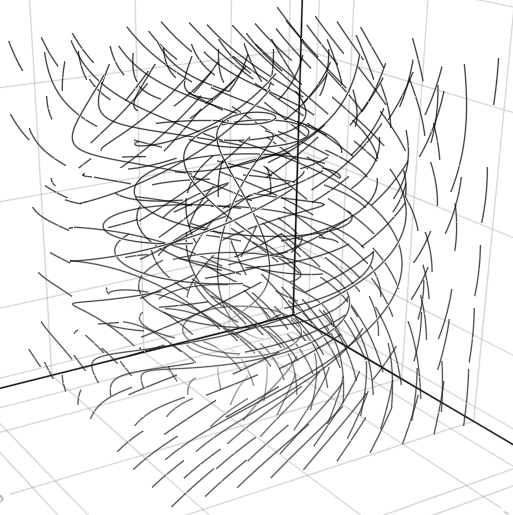

```Julia
using Grassmann, Makie; @basis S"∞+++"
f(t) = ↓(exp(t*v∞*(sin(3t)*3v1+cos(2t)*7v2-sin(5t)*4v3)/2)>>>↑(v1+v2-v3))
lines(points(f,V(2,3,4))
```
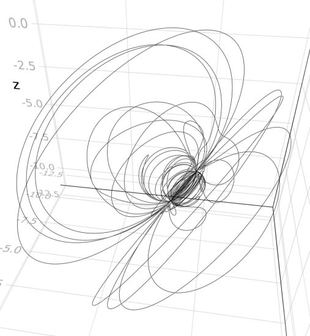

```Julia
using Grassmann, Makie; @basis S"∞+++"
f(t) = ↓(exp(t*(v12+0.07v∞*(sin(3t)*3v1+cos(2t)*7v2-sin(5t)*4v3)/2))>>>↑(v1+v2-v3))
lines(points(f,V(2,3,4))
```
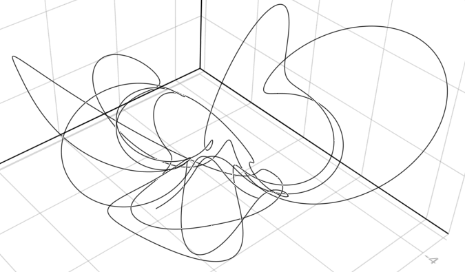


### Approaching ∞ dimensions with `SparseAlgebra` and `ExtendedAlgebra`

In order to work with a `TensorAlgebra{V}`, it is necessary for some computations to be cached. This is usually done automatically when accessed.
```Julia
julia> Λ(7) + Λ(7)'
Grassmann.SparseAlgebra{⟨+++++++-------⟩*,16384}(v, ..., v₁₂₃₄₅₆₇w¹²³⁴⁵⁶⁷)
```
One way of declaring the cache for all 3 combinations of a `VectorBundle{N}` and its dual is to ask for the sum `Λ(V) + Λ(V)'`, which is equivalent to `Λ(V⊕V')`, but this does not initialize the cache of all 3 combinations unlike the former.

Staging of precompilation and caching is designed so that a user can smoothly transition between very high dimensional and low dimensional algebras in a single session, with varying levels of extra caching and optimizations.
The parametric type formalism in `Grassmann` is highly expressive and enables pre-allocation of geometric algebra computations involving specific sparse subalgebras, including the representation of rotational groups.

It is possible to reach `Simplex` elements with up to `N=62` vertices from a `TensorAlgebra` having higher maximum dimensions than supported by Julia natively.
```Julia
julia> Λ(62)
Grassmann.ExtendedAlgebra{⟨++++++++++++++++++++++++++++++++++++++++++++++++++++++++++++++⟩,4611686018427387904}(v, ..., v₁₂₃₄₅₆₇₈₉₀abcdefghijklmnopqrstuvwxyzABCDEFGHIJKLMNOPQRSTUVWXYZ)

julia> Λ(62).v32a87Ng
-1v₂₃₇₈agN
```
The 62 indices require full alpha-numeric labeling with lower-case and capital letters. This now allows you to reach up to `4,611,686,018,427,387,904` dimensions with Julia `using Grassmann`. Then the volume element is
```Julia
v₁₂₃₄₅₆₇₈₉₀abcdefghijklmnopqrstuvwxyzABCDEFGHIJKLMNOPQRSTUVWXYZ
```
Full `MultiVector` allocations are only possible for `N≤22`, but sparse operations are also available at higher dimensions.
While `Grassmann.Algebra{V}` is a container for the `TensorAlgebra` generators of `V`, the `Grassmann.Algebra` is only cached for `N≤8`.
For the range of dimensions `8<N≤22`$, the `Grassmann.SparseAlgebra` type is used.
```Julia
julia> Λ(22)
Grassmann.SparseAlgebra{⟨++++++++++++++++++++++⟩,4194304}(v, ..., v₁₂₃₄₅₆₇₈₉₀abcdefghijkl)
```
This is the largest `SparseAlgebra` that can be generated with Julia, due to array size limitations.

To reach higher dimensions with `N>22`, the `Grassmann.ExtendedAlgebra` type is used.
It is suficient to work with a 64-bit representation (which is the default). And it turns out that with 62 standard keyboard characters, this fits nicely.
```Julia
julia> V = ℝ^22
⟨++++++++++++++++++++++⟩

julia> Λ(V+V')
Grassmann.ExtendedAlgebra{⟨++++++++++++++++++++++----------------------⟩*,17592186044416}(v, ..., v₁₂₃₄₅₆₇₈₉₀abcdefghijklw¹²³⁴⁵⁶⁷⁸⁹⁰ABCDEFGHIJKL)
```
At 22 dimensions and lower there is better caching, with further extra caching for 8 dimensions or less.
Thus, the largest Hilbert space that is fully reachable has 4,194,304 dimensions, but we can still reach out to 4,611,686,018,427,387,904 dimensions with the `ExtendedAlgebra` built in.
It is still feasible to extend to a further super-extended 128-bit representation using the `UInt128` type (but this will require further modifications of internals and helper functions.
To reach into infinity even further, it is theoretically possible to construct ultra-extensions also using dictionaries.
Full `MultiVector` elements are not representable when `ExtendedAlgebra` is used, but the performance of the `Basis` and sparse elements should be just as fast as for lower dimensions for the current `SubAlgebra` and `TensorAlgebra` types.
The sparse representations are a work in progress to be improved with time.

### Null-basis of the projective split

In the following example, the null-basis from the projective split is used:
```Julia
julia> using Grassmann; @basis S"∞∅++"
(⟨∞∅++⟩, v, v∞, v∅, v₁, v₂, v∞∅, v∞₁, v∞₂, v∅₁, v∅₂, v₁₂, v∞∅₁, v∞∅₂, v∞₁₂, v∅₁₂, v∞∅₁₂)

julia> v∞^2, v∅^2, v1^2, v2^2
(0v, 0v, v, v)

julia> v∞ ⋅ v∅
-1v

julia> v∞∅^2
v

julia> v∞∅ * v∞, v∞∅ * v∅
(-1v∞, v∅)

julia> v∞ * v∅, v∅ * v∞
(-1 + 1v∞∅, -1 - 1v∞∅)
```

### Differential forms and Leibniz tangent algebra

Multiplication with an `ϵᵢ` element is used help signify tensor fields so that differential operators are automatically applied in the `Basis` algebra as ∂ⱼ⊖(ω⊗ϵᵢ) = ∂ⱼ(ωϵᵢ) ≠ (∂ⱼ⊗ω)⊖ϵᵢ.
```Julia
julia> using Reduce, Grassmann; @mixedbasis tangent(ℝ^2,3,2);

julia> (∂1+∂12) * (:(x1^2*x2^2)*ϵ1 + :(sin(x1))*ϵ2)
0.0 + (2 * x1 * x2 ^ 2)∂₁ϵ¹ + (cos(x1))∂₁ϵ² + (4 * x1 * x2)∂₁₂ϵ¹
```

The product rule is encoded into `Grassmann` algebra when a `tangent` bundle is used, demonstrated here symbolically with `Reduce` by using the dual number definition:
```Julia
julia> using Grassmann, Reduce
Reduce (Free CSL version, revision 4590), 11-May-18 ...

julia> @mixedbasis tangent(ℝ^1)
(⟨+-₁¹⟩*, v, v₁, w¹, ϵ₁, ∂¹, v₁w¹, v₁ϵ₁, v₁∂¹, w¹ϵ₁, w¹∂¹, ϵ₁∂¹, v₁w¹ϵ₁, v₁w¹∂¹, v₁ϵ₁∂¹, w¹ϵ₁∂¹, v₁w¹ϵ₁∂¹)

julia> a,b = :x*v1 + :dx*ϵ1, :y*v1 + :dy*ϵ1
(xv₁ + dxϵ₁, yv₁ + dyϵ₁)

julia> a * b
x * y + (dy * x + dx * y)v₁ϵ₁
```
Higher order and multivariable Taylor numbers are also supported.
```Julia
julia> @basis tangent(ℝ,2,2) # 1D Grade, 2nd Order, 2 Variables
(⟨+₁₂⟩, v, v₁, ∂₁, ∂₂, ∂₁v₁, ∂₂v₁, ∂₁₂, ∂₁₂v₁)

julia> ∂1 * ∂1v1
∂₁∂₁v₁

julia> ∂1 * ∂2
∂₁₂

julia> v1*∂12
∂₁₂v₁

julia> ∂12*∂2 # 3rd order is zero
0v

julia> @mixedbasis tangent(ℝ^2,2,2); # 2D Grade, 2nd Order, 2 Variables

julia> ∇ = ∂1v1 + ∂2v2 # vector field
0v₁₂ + 1∂₁v₁ + 0∂₂v₁ + 0∂₁v₂ + 1∂₂v₂ + 0∂₁₂

julia> ∇ ⋅ ∇ # Laplacian
0.0v₁ + 0.0v₂ + 1∂₁∂₁ + 1∂₂∂₂

julia> ans*∂1 # 3rd order is zero
0.0v⃖
```
Although fully generalized, the implementation in this release is still experimental.

## Constructing linear transformations from mixed tensor product ⊗

Groups such as SU(n) can alternatively be represented with the dual Grassmann’s exterior product algebra, generating a `2^(2n)`-dimensional mother algebra with geometric product from the `n`-dimensional vector space and its dual vector space. The product of the vector basis and covector basis elements form the `n^2`-dimensional bivector subspace of the full `(2n)!/(2(2n−2)!)`-dimensional bivector sub-algebra.
The package `Grassmann` is working towards making the full extent of this number system available in Julia by using static compiled parametric type information to handle sparse sub-algebras, such as the (1,1)-tensor bivector algebra.

Note that `Λ(3)` gives the vector basis, and `Λ(3)'` gives the covector basis:
```Julia
julia> Λ(3)
Grassmann.Algebra{⟨+++⟩,8}(v, v₁, v₂, v₃, v₁₂, v₁₃, v₂₃, v₁₂₃)

julia> Λ(3)'
Grassmann.Algebra{⟨---⟩',8}(w, w¹, w², w³, w¹², w¹³, w²³, w¹²³)
```
The following command yields a local 2D vector and covector basis,
```Julia
julia> mixedbasis"2"
(⟨++--⟩*, v, v₁, v₂, w¹, w², v₁₂, v₁w¹, v₁w², v₂w¹, v₂w², w¹², v₁₂w¹, v₁₂w², v₁w¹², v₂w¹², v₁₂w¹²)

julia> w1+2w2
1w¹ + 2w²

julia> ans(v1+v2)
3v
```
The sum `w1+2w2` is interpreted as a covector element of the dual vector space, which can be evaluated as a linear functional when a vector argument is input.
Using these in the workspace, it is possible to use the Grassmann exterior `∧`-tensor product operation to construct elements `ℒ` of the (1,1)-bivector subspace of linear transformations from the `Grade{2}` algebra.
```Julia
julia> ℒ = (v1+2v2)∧(3w1+4w2)
0v₁₂ + 3v₁w¹ + 4v₁w² + 6v₂w¹ + 8v₂w² + 0w¹²
```
The element `ℒ` is a linear form which can take `Grade{1}` vectors as input,
```Julia
julia> ℒ(v1+v2)
7v₁ + 14v₂ + 0w¹ + 0w²

julia> L = [1,2] * [3,4]'; L * [1,1]
2-element Array{Int64,1}:
  7
 14
```
which is a computation equivalent to a matrix computation.

The `TensorAlgebra` evalution is still a work in progress, and the API and implementation may change as more features and algebraic operations and product structure are added.

## Importing the generators of the Leech lattice

In the example below, we define a constant `Leech` which can be used to obtain linear combinations of the Leech lattice,
```Julia
julia> using Grassmann

julia> generator = [8 0 0 0 0 0 0 0 0 0 0 0 0 0 0 0 0 0 0 0 0 0 0 0;
       4 4 0 0 0 0 0 0 0 0 0 0 0 0 0 0 0 0 0 0 0 0 0 0;
       4 0 4 0 0 0 0 0 0 0 0 0 0 0 0 0 0 0 0 0 0 0 0 0;
       4 0 0 4 0 0 0 0 0 0 0 0 0 0 0 0 0 0 0 0 0 0 0 0;
       4 0 0 0 4 0 0 0 0 0 0 0 0 0 0 0 0 0 0 0 0 0 0 0;
       4 0 0 0 0 4 0 0 0 0 0 0 0 0 0 0 0 0 0 0 0 0 0 0;
       4 0 0 0 0 0 4 0 0 0 0 0 0 0 0 0 0 0 0 0 0 0 0 0;
       2 2 2 2 2 2 2 2 0 0 0 0 0 0 0 0 0 0 0 0 0 0 0 0;
       4 0 0 0 0 0 0 0 4 0 0 0 0 0 0 0 0 0 0 0 0 0 0 0;
       4 0 0 0 0 0 0 0 0 4 0 0 0 0 0 0 0 0 0 0 0 0 0 0;
       4 0 0 0 0 0 0 0 0 0 4 0 0 0 0 0 0 0 0 0 0 0 0 0;
       2 2 2 2 0 0 0 0 2 2 2 2 0 0 0 0 0 0 0 0 0 0 0 0;
       4 0 0 0 0 0 0 0 0 0 0 0 4 0 0 0 0 0 0 0 0 0 0 0;
       2 2 0 0 2 2 0 0 2 2 0 0 2 2 0 0 0 0 0 0 0 0 0 0;
       2 0 2 0 2 0 2 0 2 0 2 0 2 0 2 0 0 0 0 0 0 0 0 0;
       2 0 0 2 2 0 0 2 2 0 0 2 2 0 0 2 0 0 0 0 0 0 0 0;
       4 0 0 0 0 0 0 0 0 0 0 0 0 0 0 0 4 0 0 0 0 0 0 0;
       2 0 2 0 2 0 0 2 2 2 0 0 0 0 0 0 2 2 0 0 0 0 0 0;
       2 0 0 2 2 2 0 0 2 0 2 0 0 0 0 0 2 0 2 0 0 0 0 0;
       2 2 0 0 2 0 2 0 2 0 0 2 0 0 0 0 2 0 0 2 0 0 0 0;
       0 2 2 2 2 0 0 0 2 0 0 0 2 0 0 0 2 0 0 0 2 0 0 0;
       0 0 0 0 0 0 0 0 2 2 0 0 2 2 0 0 2 2 0 0 2 2 0 0;
       0 0 0 0 0 0 0 0 2 0 2 0 2 0 2 0 2 0 2 0 2 0 2 0;
       -3 1 1 1 1 1 1 1 1 1 1 1 1 1 1 1 1 1 1 1 1 1 1 1]

julia> const E24,W24 = Λ(24), ℝ^24+(ℝ^24)';

julia> const Leech = SChain{Float64,W24}(generator./sqrt(8));

julia> typeof(Leech)
SChain{Float64,⟨++++++++++++++++++++++++------------------------⟩*,2,1128}

julia> ndims(vectorspace(Leech))
48
```
The `Leech` generator matrix is contained in the 1128-dimensional bivector subalgebra of the space with 48 indices.
```Julia
julia> Leech(E24.v1)
2.82842712474619v₁ + 0.0v₂ + 0.0v₃ + 0.0v₄ + 0.0v₅ + 0.0v₆ + 0.0v₇ + 0.0v₈ + 0.0v₉ + 0.0v₀ + 0.0va + 0.0vb + 0.0vc + 0.0vd + 0.0ve + 0.0vf + 0.0vg + 0.0vh + 0.0vi + 0.0vj + 0.0vk + 0.0vl + 0.0vm + 0.0vn + 0.0w¹ + 0.0w² + 0.0w³ + 0.0w⁴ + 0.0w⁵ + 0.0w⁶ + 0.0w⁷ + 0.0w⁸ + 0.0w⁹ + 0.0w⁰ + 0.0wA + 0.0wB + 0.0wC + 0.0wD + 0.0wE + 0.0wF + 0.0wG + 0.0wH + 0.0wI + 0.0wJ + 0.0wK + 0.0wL + 0.0wM + 0.0wN

julia> Leech(E24.v2)
1.414213562373095v₁ + 1.414213562373095v₂ + 0.0v₃ + 0.0v₄ + 0.0v₅ + 0.0v₆ + 0.0v₇ + 0.0v₈ + 0.0v₉ + 0.0v₀ + 0.0va + 0.0vb + 0.0vc + 0.0vd + 0.0ve + 0.0vf + 0.0vg + 0.0vh + 0.0vi + 0.0vj + 0.0vk + 0.0vl + 0.0vm + 0.0vn + 0.0w¹ + 0.0w² + 0.0w³ + 0.0w⁴ + 0.0w⁵ + 0.0w⁶ + 0.0w⁷ + 0.0w⁸ + 0.0w⁹ + 0.0w⁰ + 0.0wA + 0.0wB + 0.0wC + 0.0wD + 0.0wE + 0.0wF + 0.0wG + 0.0wH + 0.0wI + 0.0wJ + 0.0wK + 0.0wL + 0.0wM + 0.0wN

julia> Leech(E24.v3)
1.414213562373095v₁ + 0.0v₂ + 1.414213562373095v₃ + 0.0v₄ + 0.0v₅ + 0.0v₆ + 0.0v₇ + 0.0v₈ + 0.0v₉ + 0.0v₀ + 0.0va + 0.0vb + 0.0vc + 0.0vd + 0.0ve + 0.0vf + 0.0vg + 0.0vh + 0.0vi + 0.0vj + 0.0vk + 0.0vl + 0.0vm + 0.0vn + 0.0w¹ + 0.0w² + 0.0w³ + 0.0w⁴ + 0.0w⁵ + 0.0w⁶ + 0.0w⁷ + 0.0w⁸ + 0.0w⁹ + 0.0w⁰ + 0.0wA + 0.0wB + 0.0wC + 0.0wD + 0.0wE + 0.0wF + 0.0wG + 0.0wH + 0.0wI + 0.0wJ + 0.0wK + 0.0wL + 0.0wM + 0.0wN

...
```
Then a `TensorAlgebra` evaluation of `Leech` at an `Integer` linear combination would be
```Julia
julia> Leech(E24.v1 + 2*E24.v2)
5.65685424949238v₁ + 2.82842712474619v₂ + 0.0v₃ + 0.0v₄ + 0.0v₅ + 0.0v₆ + 0.0v₇ + 0.0v₈ + 0.0v₉ + 0.0v₀ + 0.0va + 0.0vb + 0.0vc + 0.0vd + 0.0ve + 0.0vf + 0.0vg + 0.0vh + 0.0vi + 0.0vj + 0.0vk + 0.0vl + 0.0vm + 0.0vn + 0.0w¹ + 0.0w² + 0.0w³ + 0.0w⁴ + 0.0w⁵ + 0.0w⁶ + 0.0w⁷ + 0.0w⁸ + 0.0w⁹ + 0.0w⁰ + 0.0wA + 0.0wB + 0.0wC + 0.0wD + 0.0wE + 0.0wF + 0.0wG + 0.0wH + 0.0wI + 0.0wJ + 0.0wK + 0.0wL + 0.0wM + 0.0wN

julia> ans⋅ans
39.99999999999999v

julia> Leech(E24.v2 + E24.v5)
2.82842712474619v₁ + 1.414213562373095v₂ + 0.0v₃ + 0.0v₄ + 0.0v₅ + 0.0v₆ + 0.0v₇ + 0.0v₈ + 0.0v₉ + 0.0v₀ + 1.414213562373095va + 0.0vb + 0.0vc + 0.0vd + 0.0ve + 0.0vf + 0.0vg + 0.0vh + 0.0vi + 0.0vj + 0.0vk + 0.0vl + 0.0vm + 0.0vn + 0.0w¹ + 0.7071067811865475w² + 1.414213562373095w³ + 1.414213562373095w⁴ + 0.0w⁵ + 0.0w⁶ + 0.0w⁷ + 0.0w⁸ + 0.0w⁹ + 0.0w⁰ + 0.0wA + 0.0wB + 0.0wC + 0.0wD + 0.0wE + 0.0wF + 0.0wG + 0.0wH + 0.0wI + 0.0wJ + 0.0wK + 0.0wL + 0.0wM + 0.0wN

julia> ans⋅ans
7.499999999999998v
```
The `Grassmann` package is designed to smoothly handle high-dimensional bivector algebras with headroom to spare. Although some of these calculations may have an initial delay, repeated calls are fast due to built-in caching and pre-compilation.

In future updates, more emphasis will be placed on increased type-stability with more robust sparse output allocation in the computational graph and minimal footprint but maximal type-stability for intermediate results and output.

## Symbolic coefficients by declaring an alternative scalar algebra

Due to the abstract generality of the code generation of the `Grassmann` product algebra, it is easily possible to extend the entire set of operations to other kinds of scalar coefficient types.
```Julia
julia> using GaloisFields, Grassmann

julia> const F = GaloisField(7)
𝔽₇

julia> basis"2"
(⟨++⟩, v, v₁, v₂, v₁₂)

julia> @btime F(3)*v1
  21.076 ns (2 allocations: 32 bytes)
3v₁

julia> @btime inv($ans)
  26.636 ns (0 allocations: 0 bytes)
5v₁
```
By default, the coefficients are required to be `<:Number`. However, if this does not suit your needs, alternative scalar product algebras can be specified with
```Julia
Grassmann.generate_algebra(:AbstractAlgebra,:SetElem)
```
where `:SetElem` is the desired scalar field and `:AbstractAlgebra` is the scope which contains the scalar field.

With the usage of `Requires`, symbolic scalar computation with [Reduce.jl](https://github.com/chakravala/Reduce.jl) and other packages is automatically enabled, e.g.
```Julia
julia> using Reduce, Grassmann
Reduce (Free CSL version, revision 4590), 11-May-18 ...

julia> basis"2"
(⟨++⟩, v, v₁, v₂, v₁₂)

julia> (:a*v1 + :b*v2) ⋅ (:c*v1 + :d*v2)
(a * c + b * d)v

julia> (:a*v1 + :b*v2) ∧ (:c*v1 + :d*v2)
0.0 + (a * d - b * c)v₁₂

julia> (:a*v1 + :b*v2) * (:c*v1 + :d*v2)
a * c + b * d + (a * d - b * c)v₁₂
```
If these compatibility steps are followed, then `Grassmann` will automatically declare the product algebra to use the `Reduce.Algebra` symbolic field operation scope.

```Julia
julia> using Reduce,Grassmann; basis"4"
Reduce (Free CSL version, revision 4590), 11-May-18 ...
(⟨++++⟩, v, v₁, v₂, v₃, v₄, v₁₂, v₁₃, v₁₄, v₂₃, v₂₄, v₃₄, v₁₂₃, v₁₂₄, v₁₃₄, v₂₃₄, v₁₂₃₄)

julia> P,Q = :px*v1 + :py*v2 + :pz* v3 + v4, :qx*v1 + :qy*v2 + :qz*v3 + v4
(pxv₁ + pyv₂ + pzv₃ + 1.0v₄, qxv₁ + qyv₂ + qzv₃ + 1.0v₄)

julia> P∧Q
0.0 + (px * qy - py * qx)v₁₂ + (px * qz - pz * qx)v₁₃ + (px - qx)v₁₄ + (py * qz - pz * qy)v₂₃ + (py - qy)v₂₄ + (pz - qz)v₃₄

julia> R = :rx*v1 + :ry*v2 + :rz*v3 + v4
rxv₁ + ryv₂ + rzv₃ + 1.0v₄

julia> P∧Q∧R
0.0 + ((px * qy - py * qx) * rz - ((px * qz - pz * qx) * ry - (py * qz - pz * qy) * rx))v₁₂₃ + (((px * qy - py * qx) + (py - qy) * rx) - (px - qx) * ry)v₁₂₄ + (((px * qz - pz * qx) + (pz - qz) * rx) - (px - qx) * rz)v₁₃₄ + (((py * qz - pz * qy) + (pz - qz) * ry) - (py - qy) * rz)v₂₃₄
```

It should be straight-forward to easily substitute any other extended algebraic operations and fields; issues with questions or pull-requests to that end are welcome.

## References
* Emil Artin, [Geometric Algebra](https://archive.org/details/geometricalgebra033556mbp). 1957.
* John Browne, [Grassmann Algebra, Volume 1: Foundations](https://www.grassmannalgebra.com/). 2011.
* C. Doran, D. Hestenes, F. Sommen, and N. Van Acker, [Lie groups as spin groups](http://geocalc.clas.asu.edu/pdf/LGasSG.pdf), J. Math Phys. (1993)
* David Hestenes, [Universal Geometric Algebra](http://lomont.org/math/geometric-algebra/Universal%20Geometric%20Algebra%20-%20Hestenes%20-%201988.pdf), Pure and Applied (1988)
* David Hestenes, [Tutorial on geometric calculus](http://geocalc.clas.asu.edu/pdf/Tutorial%20on%20Geometric%20Calculus.pdf). Advances in Applied Clifford Algebra, 2013.
* Lachlan Gunn, Derek Abbott, James Chappell, Ashar Iqbal, [Functions of multivector variables](https://www.ncbi.nlm.nih.gov/pmc/articles/PMC4361175/pdf/pone.0116943.pdf). 2011.
* Aaron D. Schutte, [A nilpotent algebra approach to Lagrangian mechanics and constrained motion](https://www-robotics.jpl.nasa.gov/publications/Aaron_Schutte/schutte_nonlinear_dynamics_1.pdf). 2016.
* Vladimir and Tijana Ivancevic, [Undergraduate lecture notes in DeRahm-Hodge theory](https://arxiv.org/abs/0807.4991). arXiv, 2011.
* Peter Woit, [Clifford algebras and spin groups](http://www.math.columbia.edu/~woit/LieGroups-2012/cliffalgsandspingroups.pdf), Lecture Notes (2012)
